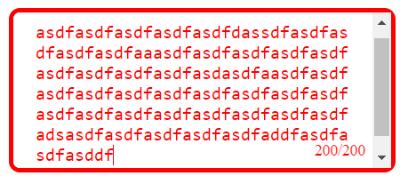

Restricted Textarea 

A simple textarea with live character count and max character limit.

Web link - https://abh7n.github.io/restricted-text-area/

Features

- Live character count display
- Max character limit (default: 200)
- Textarea border and text turn red when limit is reached

Installation

1. Clone the repository: `git clone (link unavailable)
2. Open index.html in your browser

Usage

1. Type in the textarea to see the live character count.
2. When the character limit is reached, the textarea border and text will turn red.

Customization

- Adjust the max character limit by changing the maxlength attribute in index.html.
- Modify the CSS styles in style.css to customize the appearance.

Browser Support

- Tested in Google Chrome, Mozilla Firefox, and Microsoft Edge.

License

MIT License

Contributing

Pull requests and issues welcome!

Author

(link unavailable)
